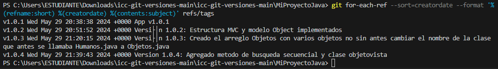

# Mi Proyecto Java
   Este es un proyecto Java simple para demostrar el manejo de versiones con Git.
  
   ## Version 1.0.0
   - Versión inicial del proyecto xd.

   ## Version 1.0.2
   - Se agrego la clase objeto con sus atributos y metodos adecuados

  #### Versión v1.0.3: 
  
  Implementación de Arreglo de Objetos

   Se modifica la clase principal main para incluir un arreglo de objetos `Objetos`, inicializando varios objetos con diferentes valores.

   ## Version v 1.0.3: 

   

   ### Version v 1.0.4 Creado clase vista con metodos

   ## Version v2.0.0 
   Programa funcionando correctamente
   